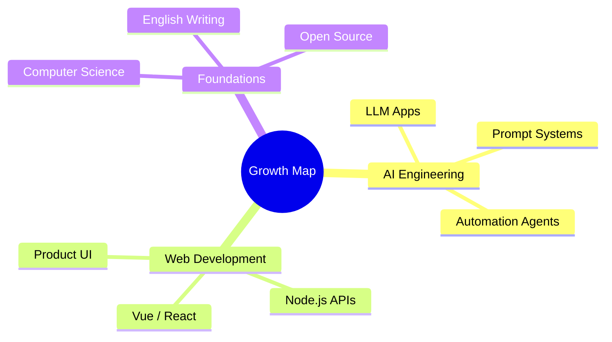

---

## 👨‍💻 About Me

> Currently pursuing a dual degree at **Henan University** and **Victoria University**. 
> Passionate about turning ideas into useful products with **AI + Web engineering**.

- 🚀 Building practical **AI-powered applications, tools, and automation workflows**
- 🧠 Learning deeply across **LLMs, full-stack development, and product engineering**
- 🛠️ Enjoy working with **Vue / React / Node.js / Python**
- 🌱 Motto: **Think clearly. Build fast. Iterate continuously.**
- 💬 Ask me anything via [GitHub Issues](https://github.com/WangShen9000/WangShen9000/issues)

---

## 🧰 Tech Stack

### Languages

### Frontend & Backend

### Tools I Like

---

## 📌 Featured Projects

---

## 📊 GitHub Analytics

---

## 🗺️ Current Focus

---

### ✨ Thanks for visiting!

