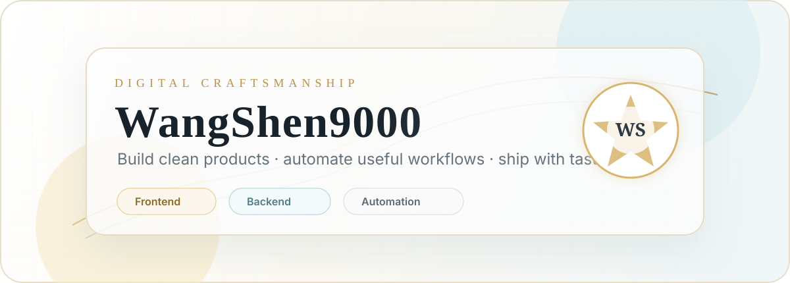
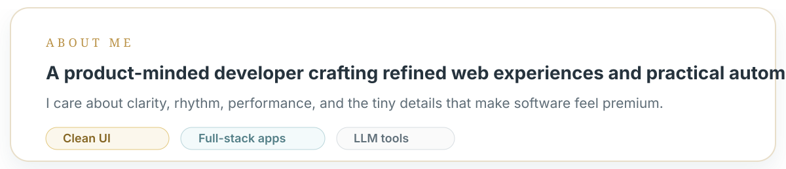
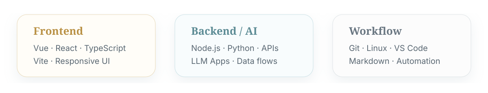
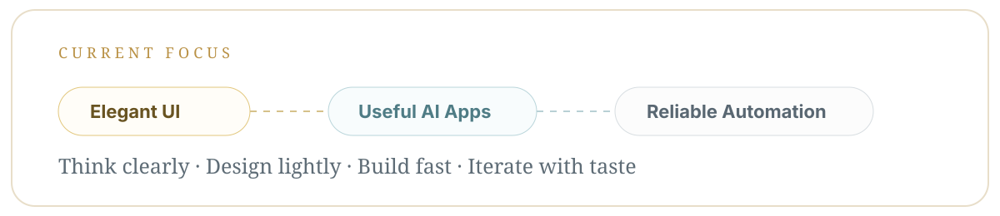

 

<a href="mailto:shenw470@gmail.com">Email</a> ·
<a href="https://github.com/WangShen007?tab=followers">Followers</a> ·
<a href="https://github.com/WangShen007?tab=repositories">Repositories</a>

## About

## Stack

## Featured Work

<table>
<tr>
<td width="50%"></td>
<td width="50%"></td>
</tr>
<tr>
<td width="50%"></td>
<td width="50%"></td>
</tr>
</table>

## Now

### Minimal surface. Clear structure. Premium details.

