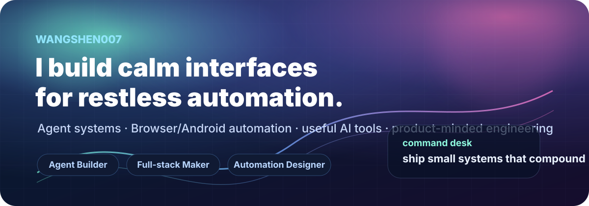
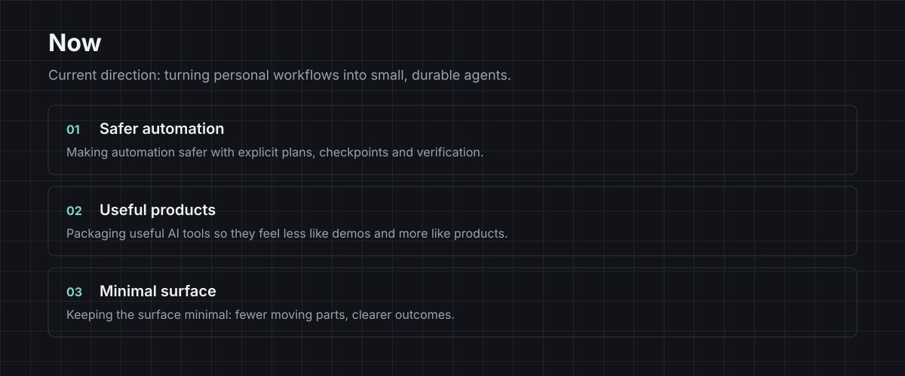
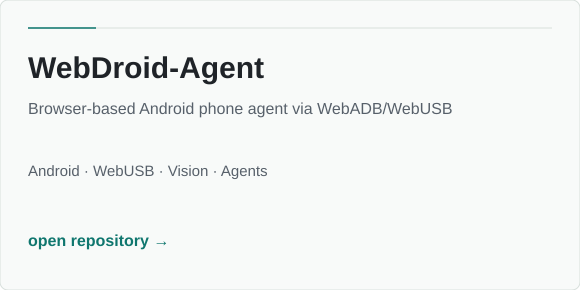
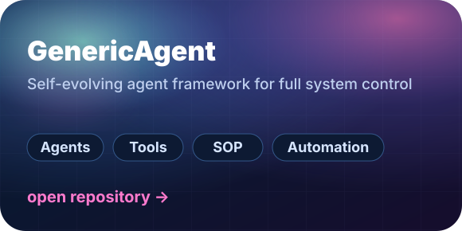
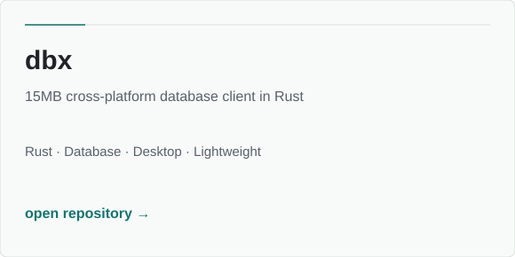
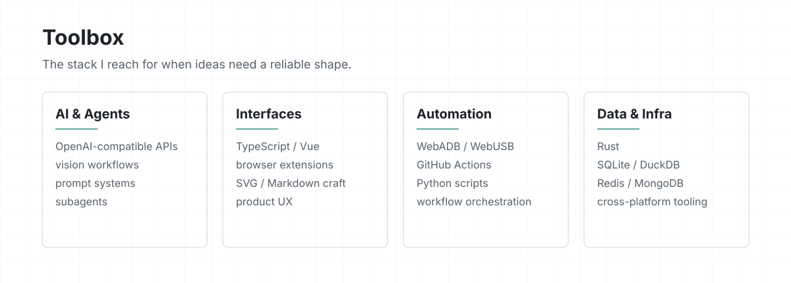

<div align="center">



<a href="https://github.com/WangShen007?tab=repositories"></a>
<a href="https://linux.do/u/wangshen007"></a>
<a href="mailto:shenw470@gmail.com"></a>

<br />

<a href="https://git.io/typing-svg"></a>

</div>


## 你好，我是王珅 · WangShen007

我喜欢研究 **AI 与 Agent**，也喜欢把它们接到真实的工具、数据和工作流里。数据库出身让我习惯先问：状态在哪里、失败如何恢复、结果怎样验证。现在，我正在把这套思维带进 Agent Engineering。

```text
$ whoami
wangshen007  |  agent enthusiast  |  AI tinkerer  |  LinuxDo Lv.3  |  hexagon warrior
$ mission
make useful things · keep the feedback loop short · ship with evidence
```

## 六边形战士 · Hexagon profile

| 维度 | 我在持续练习的事 | 维度 | 我在持续练习的事 |
| :--- | :--- | :--- | :--- |
| ◈ **Agent Engineering** | 工具调用、记忆、规划、评测与多 Agent 协作 | ◈ **AI Research** | LLM 应用、视觉工作流、提示词与模型体验 |
| ◈ **Data & DBA** | Oracle / MySQL、性能、可靠性与可观测性 | ◈ **Automation** | Python / Shell、浏览器与 Android 自动化 |
| ◈ **Linux & Infra** | Linux、容器、服务治理与故障排查 | ◈ **Expression** | 文档、开源协作、把复杂问题讲清楚 |

## 正在运行 · Now building



- 🧪 把 Agent 的 **sense → plan → act → verify** 做成可复用的工程套路
- 🧰 研究浏览器 / Android 自动化、MCP、视觉理解与个人生产力工具
- 📚 记录实验、踩坑和可复现的过程，让每次尝试都能留下证据

## 精选实验室 · Selected builds

<div align="center">
<table>
<tr>
<td width="50%"><a href="https://github.com/WangShen007/WebDroid-Agent"></a></td>
<td width="50%"><a href="https://github.com/WangShen007/GenericAgent"></a></td>
</tr>
<tr>
<td width="50%"><a href="https://github.com/WangShen007/dbx"></a></td>
<td width="50%"><a href="https://github.com/WangShen007/DailyBrief"></a></td>
</tr>
</table>
</div>

更多正在生长的项目： [Nook](https://github.com/WangShen007/Nook) · [flowing](https://github.com/WangShen007/flowing) · [findjob](https://github.com/WangShen007/findjob) · [agent-awesome-engineering](https://github.com/kobejiasuoer/awesome-agent-engineering) · [ai-job-search-codex](https://github.com/liIIASD/ai-job-search-codex)

## 工具箱 · Toolbox



<p align="center">
  
  
  
  
  
  
  
  
  
  
  
  
</p>

## 贡献轨迹 · Activity

<div align="center">
<picture>
  <source media="(prefers-color-scheme: dark)" srcset="https://github-readme-stats.vercel.app/api?username=WangShen007&amp;show_icons=true&amp;hide_border=true&amp;bg_color=00000000&amp;title_color=7dd3c7&amp;icon_color=7dd3c7&amp;text_color=f0f3f6&amp;rank_icon=github" />
  
</picture>
<picture>
  <source media="(prefers-color-scheme: dark)" srcset="https://streak-stats.demolab.com?user=WangShen007&amp;hide_border=true&amp;background=00000000&amp;ring=7DD3C7&amp;fire=7DD3C7&amp;currStreakLabel=F0F3F6&amp;sideLabels=9AA3AD&amp;dates=9AA3AD&amp;currStreakNum=F0F3F6&amp;sideNums=F0F3F6" />
  
</picture>
</div>

<div align="center">
<picture>
  <source media="(prefers-color-scheme: dark)" srcset="https://github-readme-activity-graph.vercel.app/graph?username=WangShen007&amp;bg_color=00000000&amp;color=f0f3f6&amp;line=7dd3c7&amp;point=7dd3c7&amp;area=true&amp;hide_border=true" />
  
</picture>
</div>

<div align="center">
<picture>
  <source media="(prefers-color-scheme: dark)" srcset="https://raw.githubusercontent.com/Platane/snk/output/github-contribution-grid-snake-dark.svg" />
  
</picture>
</div>

## 找到我 · Connect

[GitHub](https://github.com/WangShen007) · [LinuxDo](https://linux.do/u/wangshen007) · [Email](mailto:shenw470@gmail.com)

<div align="center">

<sub>Build small. Think in systems. Stay curious. ✦</sub>

</div>
