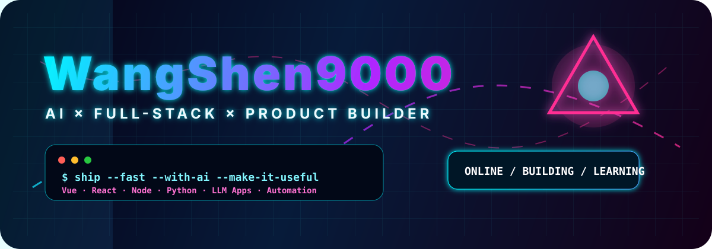
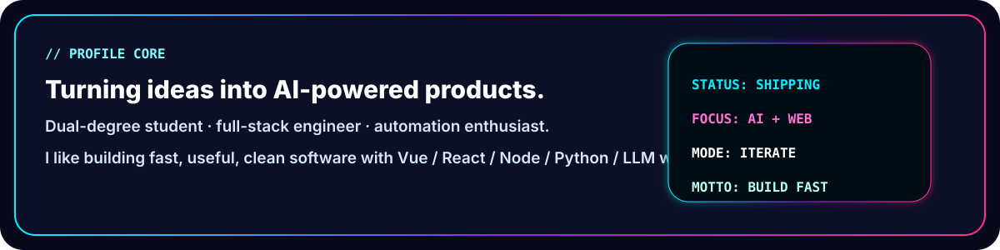
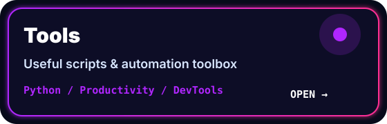
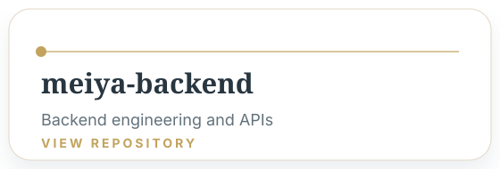
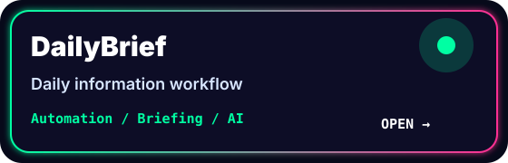

<div align="center">



<br />

<a href="mailto:shenw470@gmail.com"></a>
<a href="https://github.com/WangShen9000?tab=followers"></a>
<a href="https://github.com/WangShen9000"></a>

</div>


## ⚡ About Me



## 🧬 Tech Arsenal

<div align="center">

| Frontend | Backend / AI | Tooling |
| --- | --- | --- |
| JavaScript · TypeScript · Vue · React · Vite | Node.js · Python · LLM Apps · APIs | Git · Linux · VS Code · Markdown · Automation |

</div>

## 🚀 Featured Projects

<div align="center">
<table>
<tr>
<td width="50%"><a href="https://github.com/WangShen9000/Frontend-Project"></a></td>
<td width="50%"><a href="https://github.com/WangShen9000/Tools"></a></td>
</tr>
<tr>
<td width="50%"><a href="https://github.com/WangShen9000/meiya-backend"></a></td>
<td width="50%"><a href="https://github.com/WangShen9000/DailyBrief"></a></td>
</tr>
</table>
</div>

## 🕹️ Current Focus



## 🌌 Operating Principles

```txt
THINK CLEARLY  →  BUILD FAST  →  SHIP USEFUL  →  ITERATE CONTINUOUSLY
```

<div align="center">

### ✨ Thanks for visiting my neon corner of GitHub ✨

</div>
